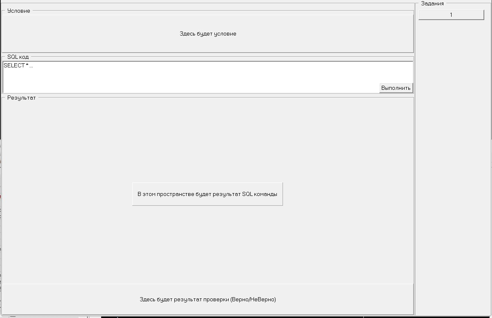

# Обучальщик SQL
### Исполнитель Саша Журавлев 9 е
### Заказчик/Науч.рук/Консультант - АЖ

В результате проекта должна получиться программа, которая поможет ученикам СПК "SQL" проще и нагляднее учиться.

## Режимы работы (Что может?)
+ Для учеников
    - Выбор уровней (На какой материал задания)
    - Встроенный компилятор SQL
    - Возможность полной работы с клавиатуры
    - Отображение измениний которые внесла программа
+ Для преподавателей
    - Возможность добавлять новые задания (Требуются файлы: условие задачи, БД, правильный ответ)
    - Возможность просмотреть сводку что сделано/не сделано

## Технические особенности

- Десктоп программа
- ОС: Windows
- Язык написания: Delphi7 (Pascal)
- База Данных: SQL, MySQL v5

## Интерфейс

